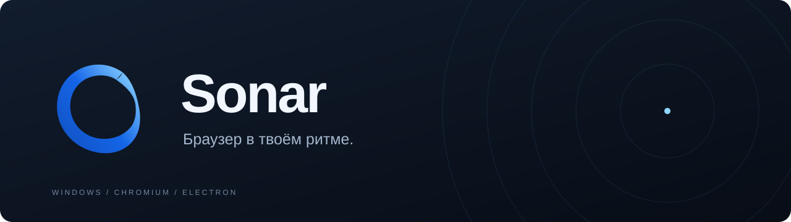
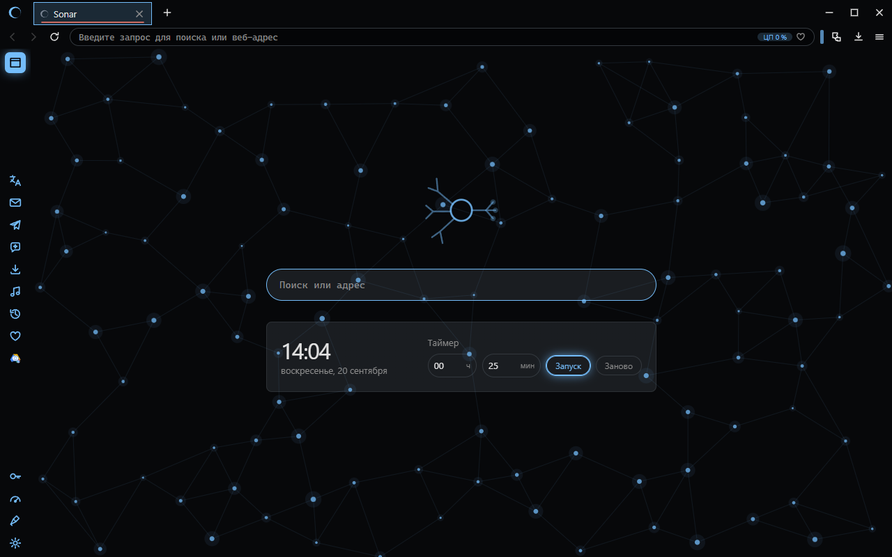
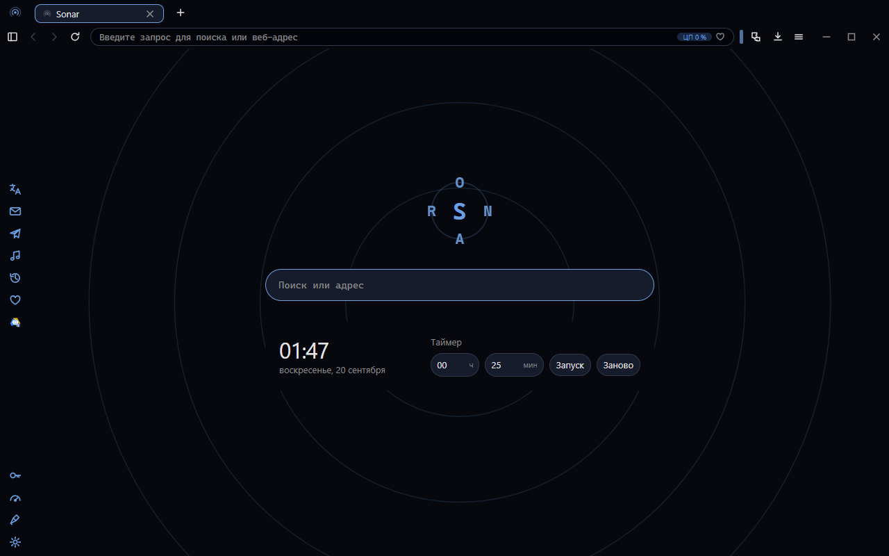
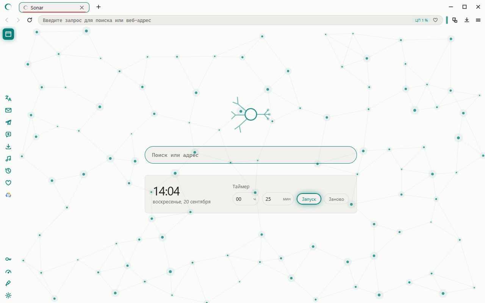

  

  Браузер для Windows на базе Chromium. 
  Свои пространства, любимые сервисы рядом и интерфейс, который можно настроить под себя.

  <a href="https://github.com/erteterya/Sonar/releases">Релизы</a> ·
  <a href="#внутри-sonar">Возможности</a> ·
  <a href="#твой-браузер-твой-вид">Скриншоты</a> ·
  <a href="https://github.com/erteterya/Sonar/issues/new/choose">Обратная связь</a>

---

## Внутри Sonar

Sonar объединяет привычные инструменты браузера с гибким оформлением. Можно разделить вкладки по задачам, держать сервисы в боковой панели и выбрать удобный вид рабочего окна.

| | Что можно делать |
| :--- | :--- |
| **Пространства** | Разделять наборы вкладок для работы, учёбы и личных дел. |
| **Боковая панель** | Открывать сервисы рядом с текущей страницей и настраивать расположение панели. |
| **Оформление** | Выбирать светлые и тёмные темы, менять цвета, форму элементов и фон новой вкладки. |
| **Новая вкладка** | Пользоваться поиском, часами и таймером для сосредоточенной работы. |
| **Профили** | Создавать отдельных пользователей со своими настройками и данными браузера. |
| **Повседневные инструменты** | Работать с закладками, историей, загрузками и PDF в одном приложении. |

## Твой браузер, твой вид

Графитовый, синий или светлый — оформление меняет характер всего интерфейса.

<table>
  <tr>
    <td width="50%"></td>
    <td width="50%"></td>
  </tr>
  <tr>
    <td align="center"><b>Полночь</b> Синие акценты и глубокий тёмный фон.</td>
    <td align="center"><b>Бумага</b> Светлая поверхность и мягкие контуры.</td>
  </tr>
</table>

Скриншоты рабочих версий: «Полночь» — 20 сентября 2026 года, «Графит» и «Бумага» — 12 сентября 2026 года. Внешний вид следующих сборок может меняться.

## Релизы

Sonar находится в активной разработке. Целевая платформа — **Windows x64**.

Опубликованные сборки и заметки к ним доступны в разделе [Releases](https://github.com/erteterya/Sonar/releases). Если раздел пуст, публичная сборка ещё не опубликована.

Этот репозиторий пока служит страницей проекта и местом для обратной связи. Исходный код браузера здесь ещё не размещён.

## Помочь проекту

- **Нашёл ошибку?** [Создай отчёт](https://github.com/erteterya/Sonar/issues/new?template=bug_report.yml): укажи версию Sonar, версию Windows и шаги, после которых возникает проблема.
- **Есть идея?** [Предложи улучшение](https://github.com/erteterya/Sonar/issues/new?template=feature_request.yml): расскажи, какую задачу оно поможет решить.
- **Хочешь следить за развитием?** Добавь репозиторий в избранное или включи уведомления о релизах через Watch.

---

  <b>Sonar</b> 
  Сделано <a href="https://github.com/erteterya">erteterya</a> · Chromium / Electron · Windows

